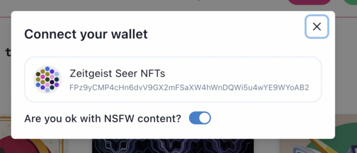
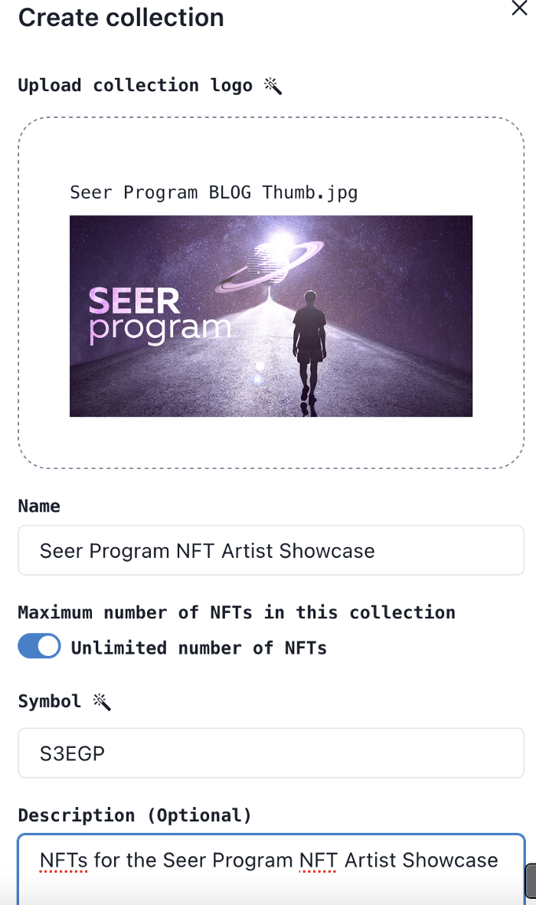
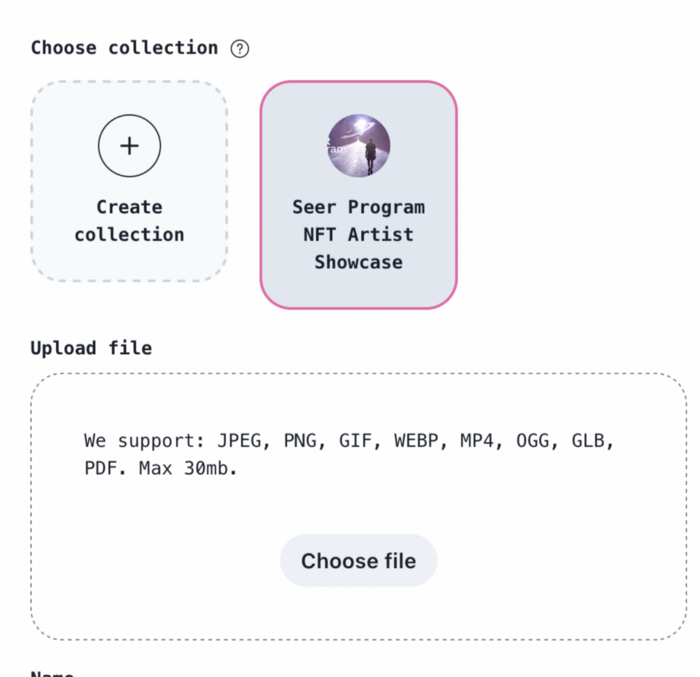
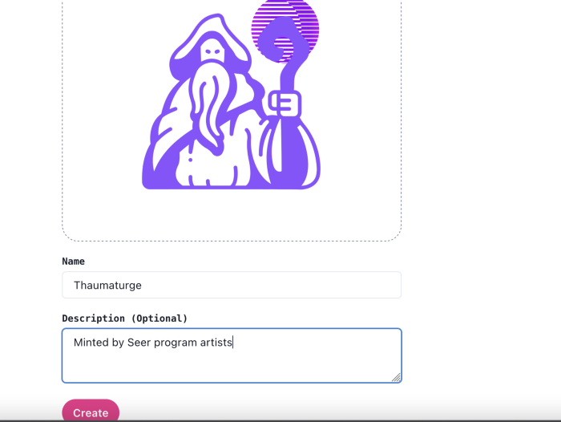

## How to mint on RMRK for the Zeitgeist Seer program NFT Artist Showcase
> ## 如何在 RMRK 上为“ NFT 艺术家展示活动（Zeitgeist Seer program NFT Artist Showcase）”铸造 NFT

In this article we will go over the process of minting your own NFT on the singular.RMRK app.
> 在本文中，我们将介绍如何在 single.RMRK 应用程序上创建您自己的 NFT。

Minting your own NFT may seem intimidating, but thankfully with the RMRK app it has become a very easy process! In this guide we will go over the steps you must take to mint your very own NFT with the RMRK app from your Seer program wallet.
> 铸造您自己的 NFT 听起来似乎有些困难，但幸运的是，RMRK 应用程序让它变成了一件非常容易的事情。在本指南中，我们将介绍使用先知计划钱包（Seer program wallet）和 RMRK 应用程序铸造您自己的 NFT 的整个流程。

### What you need
- The polkadot.js browser extension  
- A Seer program specific substrate wallet (Guide: https://www.youtube.com/watch?v=ySh3fGl3UAM)  
- A tiny amount of KSM  
- A JPEG, PNG, GIF, WEBP, MP4, OGG, GLB, PDF file of your NFT (maximum size 30mb)
> ### 您需要准备什么？
> - polkadot.js 浏览器扩展  
> - 先知计划指定的 substrate 钱包（[创建指南](https://www.youtube.com/watch?v=ySh3fGl3UAM) ）  
> - 少量的 KSM  
> - 您铸造 NFT 所需的图片或视频，它们可以是 JPEG, PNG, GIF, WEBP, MP4, OGG, GLB, PDF 格式（最大 30mb）

### Connect your wallet
Once you are on singular.rmrk.app you need to connect your Seer Program Wallet to the app by clicking the “Connect wallet” button.  
**!!Make sure you select your Seer Program specific wallet!!**
> ### 连接您的钱包
> 进入 [singular.rmrk.app](https://singular.rmrk.app/) 后，您需要通过单击“连接钱包（Connect wallet）”按钮将您的先知计划钱包连接到该应用程序。如下图所示。
> /2021-09-26-15-07-22.png)
>   
> **!!请确保您选择了指定的先知计划钱包!!**
> 

### Minting your NFT on RMRK
Now that you have connected your wallet to the RMRK app, it is time to mint your NFT!  
Click on the “Create” button on the top of the page.  
Every NFT minted on RMRK has to be a part of collection. So first you must create your own collection.  
Once you have created your collection you will be brought back the to “Create” screen and will see your newly created collection as a selectable option.  
Select your new collection and click on the “Choose file” button to upload your NFT file!  
**!!!Make sure you include the Line “Minted by Seer program artists” in the “Description” field!!!**  
Now all you have to do is hit the create button and sign the transaction with your Seer program specific wallet!  
Congratulations! You have just minted your very own NFT on RMRK!  
Now all that is left to do is submit a link to your NFT and a few other details with the form found in the #nft-artist-showcase channel inside the Seer Program Discord!

> ### 在 RMRK 上铸造您的NFT
> 现在您已将钱包连接到 RMRK 应用程序了，是时候铸造您的 NFT 了！  
> 单击页面顶部的“创建（Create）”按钮。如下图所示。
>   
> 在 RMRK 上铸造的每个 NFT 都必须是集合的一部分。 所以首先您必须创建您自己的集合。如下图所示。
>   
> 创建完集合后，您将返回到 “创建” 界面，并在可选选项中看到您刚才创建的集合。  
> 选择您新建的集合，然后单击 “选择文件（Choose file）” 按钮上传您的 NFT 文件！如下图所示。  
> 
> **!!!在您的 NFT 作品描述字段中，您必须包含一行“由先知计划艺术家铸造”。(即 Minted by Seer program artists)!!!** 如下图所示。  
> 
> 接下来，您只需要点击 “创建（create）” 按钮并使用您指定的先知计划钱包签名交易即可完成！  
> 恭喜您！您刚刚在 RMRK 上铸造了属于自己的 NFT！  
> 最后，您需要在 Seer Program Discord 内的 #nft-artist-showcase 频道中找到 NFT 表单并填写您的 NFT 链接和一些其他的详细信息！
