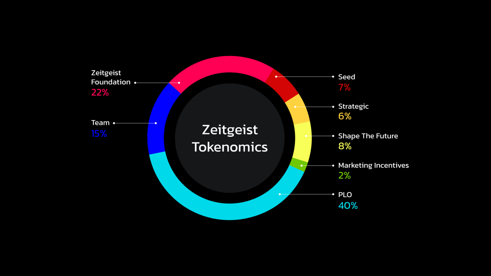
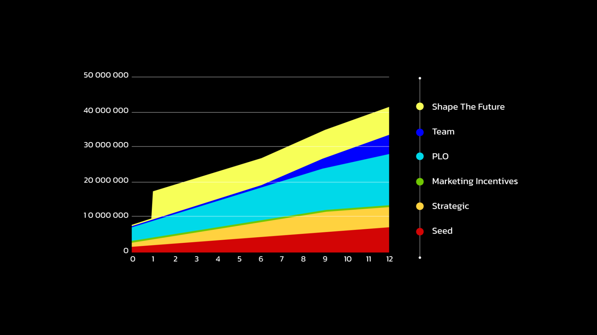
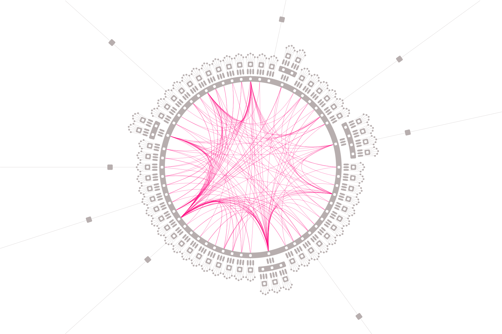

# Zeitgeist Token (ZTG)  

> # Zeitgeist（预言家） 的 Token 模型介绍

The ZTG is Zeitgeist's native token. It is necessary for correct operation of the network. Honest participants are rewarded ZTG and malicious actors can lose their ZTG.

> ZTG 是 Zeitgeist 的原生代币，是保证网络正确运行所必需的。诚实的参与者将获得 ZTG 奖励，恶意行为者可能会失去他们的 ZTG。

## Quick Facts

- Token Name: Zeitgeist (ZTG)
- Smallest Unit: 1 Pennock (1^10 Pennocks = 1 ZTG)
- Genesis Supply: 100 Million
- Anticipated Launch: End of Year 2021
- Annual Inflation: 5%
- Fees: 80% burned / 20% treasury

> ## 简介
> - 代币名：ZTG
> - 最小单位：1 Pennock（1^10 Pennocks = 1 ZTG）
> - 创世总量：1亿
> - 预计推出时间：2021年底
> - 年通胀率：5%
> - 交易费：80%燃烧 / 20%上缴国库

## Uses of ZTG

ZTG is used in various parts of the core protocol. The main uses are outlined below:

- The base currency that prediction markets can settle in.
- The governance token which will be used to make binding decisions over the direction of the Zetigeist chain.
- In dispute resolution, it is staked to join the Zeitgeist court system. Holders to stake to join the court can receive rewards for correctly resolving problematic oracles or market disputes.
- As bonds for creation of markets, selecting oracles, joining the council, making treasury proposals, setting on-chain identities, voting, creating DAOs, and other parts of the protocol.
- As the currency for transaction fees.

> ## ZTG的用途  
> ZTG 用于核心协议的各个部分。主要用途概述如下：
> - 预测市场可以结算的基础货币。
> - 治理代币将用于对 Zetigeist 链的方向做出有约束力的决定。
> - 在争议解决中，加入 Zeitgeist 法院系统是有成本的。持有人可以选择加入法院，通过正确解决有问题的预言机或预测市场纠纷来获得奖励。
> - 作为创建市场、选择预言机、加入理事会、提出国库提案、设置链上身份、投票、创建 DAO 和协议其他部分的债券。
> - 作为交易费。

## ZTG Distribution

| Allocation | Amount | Percent | Description |
| ---- | ---- |---- | ---- |
| Seed Sale | 7,000,000 | 7% | Subject to 12 months vesting with 20% available at genesis and 80% on a linear schedule.|
| Strategic Sale | 6,000,000 | 6% | Subject to 9 months vesting with 20% available at genesis and 80% on a linear schedule.|
| Shape the Future | 8,000,000 | 8% | Subject to a 30 day lock up. |
| Marketing Incentives | 2,000,000 | 2% | Rewards that are granted to the community through marketing efforts such as the Kusama Derby, the Zeitgeist Beta Campaign, and future events.|
| Parachain Lease | 40,000,000 | 40% | These funds are reserved for incentivizing Zeitgeist’s parachain lease on Kusama for the first 6 years. It will likely be paid out to users who lock KSM in continuous interest payments similar to staking.|
| Team and Advisors | 15,000,000 | 15% | Subject to 24 months vesting with 20% availabe at genesis and 80% on a linear schedule. Under the control of ZeitgeistPM LLC to reward early team members and future employees.|
| Zeitgeist Foundation | 22,000,000 | 22% | Funds to be used to in developer partnerships programs, as grants to teams that build on Zeitgeist, in future airdrops or sales. Under the control of Zeitgeist Foundation, a non-profit entity separate from ZeitgeitPM LLC.|

> ## 代币分配
> 

| 分配 | 数量 | 百分比 | 具体信息 |
| ---- | ---- |---- | ---- |
| 种子轮 | 700w | 7% | 锁定 12 个月，创世时解锁 20%，剩下 80% 在 12 个月内线性解锁。 |
| 战略销售 | 600w | 6% | 锁定 9 个月，创世时解锁 20%，剩下 80% 在 9 个月内线性解锁。 |
| 塑造未来 | 800w | 8% | 锁定 30 天。 |
| 社区激励 | 200w | 2% | 通过 Kusama Derby、Zeitgeist Beta 活动和未来活动等营销活动激励社区的奖励。 |
| 平行链租赁 | 4000w | 40% | 这些资金将用于在前 6 年激励 Zeitgeist 在 Kusama 上的平行链租赁。它可能会奖励给那些帮助我们进行平行链租赁而锁定 KSM 的用户。 |
| 团队成员 | 1500w | 15% | 锁定 24 个月，创世时解锁 20%，剩下 80% 在 24 个月内线性解锁。在 Zeitgeist 公司的控制下奖励给早期团队成员和未来团队成员。 |
| Zeitgeist 基金会 | 2200w | 22% | 资金将用于开发者合作伙伴计划，作为对基于 Zeitgeist 的团队的资助，用于未来的空投或销售。在 Zeitgeist 基金会的控制下，这是一个独立于 ZeitgeitPM 公司的非营利组织。 |

## ZTG Release Schedule

Below is the ZTG release schedule for the first year of the network.

> ## ZTG 释放时间表
> 以下是 Zeitgeist 网络第一年的 ZTG 释放时间图。 

## Kusama Parachain
Zeitgeist is choosing to target the [Kusama network](https://kusama.network/) as the Relay Chain for ensuring security and enabling crosschain functionality.
Kusama is Polkadot's canary network that gets the features of Polkadot first. The community has a move-fast-and-break-things culture that Zeitgeist likes.

- Kusama’s community is more experimental than Polkadot’s. It would be more welcoming to a chain which is taking such a novel approach as Zeitgeist is in regards to prediction markets and futarchy governance.
- Kusama is a top 50 network by market cap and should be secure enough for Zeitgeist’s applications.
- Kusama’s parachain lease should be cheaper than Polkadot’s which would better position Zeitgeist to attain a spot.
- A Kusama to Polkadot bridge will be made available, so Zeitgeist will still be able to interact with applications on Polkadot albeit with some added latency.
- The most core projects building on Polkadot are deploying to Kusama as well. We take a bottom-to-top approach and want to prove out the usability on the Kusama network before we consider a migration to the more secure, and more expensive Polkadot network.
- Zeitgeist might stay on Kusama because it’s a more attractive community and never migrate to Polkadot.

> ## Kusama 平行链计划
> 
> Zeitgeist 选择将 [Kusama network](https://kusama.network/) 网络作为中继链，以确保安全性并获得跨链功能。
> Kusama 是 Polkadot 的金丝雀网络，它率先获得了 Polkadot 的特性。Zeitgeist 非常认同其快速行动和打破常规的文化。
> - Kusama 的社区比 Polkadot 的社区更具实验性。我们更倾向于选择一条像 Zeitgeist 在预测市场和 Futarchy 治理方面采取新颖方法的链。
> -  Kusama 是市值排名前 50 的网络，对于 Zeitgeist 的应用程序来说应该足够安全。
> - Kusama 的平行链租赁应该比 Polkadot 便宜，这将更好地让 Zeitgeist 获得一席之地。
> - Kusama 到 Polkadot 的桥接是可用的，因此 Zeitgeist 仍将能够与 Polkadot 上的应用程序交互，尽管会增加一些延迟。
> - 在 Polkadot 上构建的最核心项目也会部署到 Kusama 上。我们采用自下而上的方法，并希望在考虑迁移到更安全、更昂贵的 Polkadot 网络之前证明 Kusama 网络的可用性。
> - Zeitgeist 可能会留在 Kusama，因为它是一个更具吸引力的社区，而且永远不会迁移到 Polkadot。

## Inflation and Fees
Zeitgeist will have a target of 5% annual inflation. Therefore, the supply of Zeitgeist over time is predictable but uncapped.

The inflation in Zeitgeist will primarily be used to incentivize ongoing security of the network. The security includes the acquisition of a parchain lease of Kusma and the selection and maintainence of collator nodes to perform the transaction collation of the chain (block production).

Of the 5% inflation, 1% will go to operators of collator nodes which do the block production, 2% will go to stakers of ZTG who help select collators, and the remaining 2% will go toward interest payments of participants who lock up KSM for acquisition of Zeitgeist’s parachain lease.

The transaction fees on Zeitgeist will be subject to 80% burn which creates a deflationary pressure on the supply. The remaining 20% of transactions fees will be sent to the on-chain treasury which will use the funds to fund the future growth of the network.

> ## 交易费和通胀
> Zeitgeist 的年通胀率为 5%。因此，随着时间的推移，Zeitgeist 的供应是可以预测的，但没有上限。
> Zeitgeist 的通胀将主要用于激励网络的持续安全。安全性包括获得 Kusma 的平行链租赁以及选择和维护 collator 节点来执行区块链的交易整理（区块生产）。
> 在 5% 的通货膨胀中，1% 将用于进行区块生产的 collator 节点的奖励，2% 将用于帮助选择 collator 的 ZTG 的抵押者，剩余的 2% 将用于激励在帮助 Zeitgeist平行链租赁中锁定 KSM 的参与者。
> Zeitgeist 的交易费用 80% 将被燃烧，这对供应造成通缩压力。剩余 20% 的交易费用将被发送到链上国库，将为网络的未来发展提供资金。
